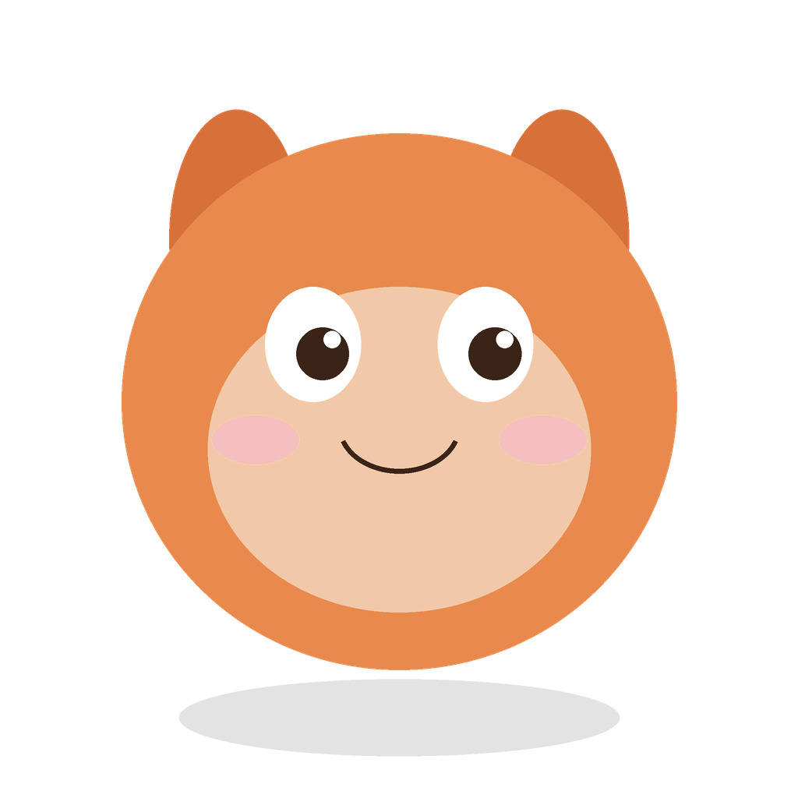
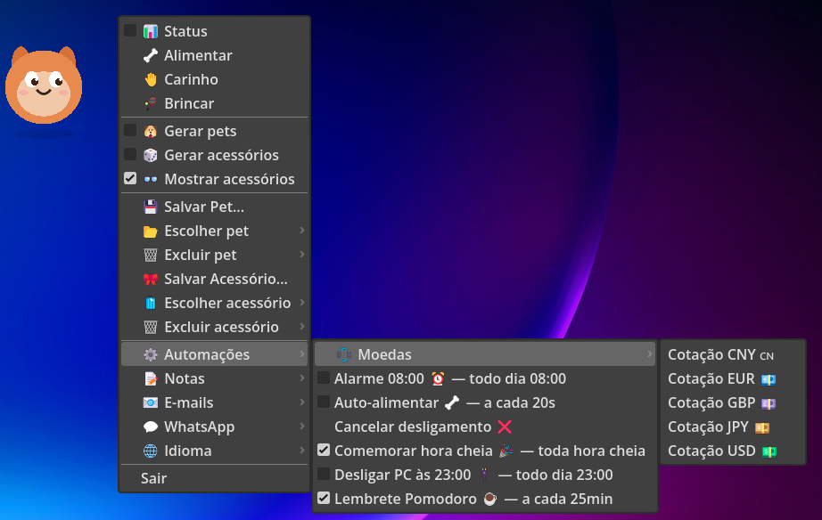

# Zimmy Pet 🧡

<p align="center">
  
</p>

<p align="center">
  <a href="https://github.com/sponsors/zimerfeld"></a>
  &nbsp;&nbsp;
  <a href="https://ko-fi.com/C0D621FCGD"></a>
</p>

<p align="center">
  <a href="https://github.com/zimerfeld/ZIMMY/stargazers"></a>
  &nbsp;
  <a href="https://github.com/zimerfeld/ZIMMY/releases"></a>
</p>

>  Zimmy is built and maintained in my free time. If this little desktop pet makes you smile, a sponsorship helps keep it updated. 💜

>  O Zimmy é construído e mantido no meu tempo livre. Se este petzinho de desktop te arranca um sorriso, um patrocínio ajuda a mantê-lo atualizado. 💜

>  The default pet (the procedural face from `_draw()`, the same drawing used for the icon).

>  O pet Default (a carinha procedural do `_draw()`, o mesmo desenho usado no ícone).

>  Desktop pet overlay, made in Godot 4.6. A transparent, borderless, always-on-top window that floats over the desktop.

>  Desktop pet overlay, feito em Godot 4.6. Uma janela transparente, sem bordas e sempre no topo que flutua sobre a área de trabalho.

>  The pet is drawn in a logical space of **200×200** and displayed at **75%** (≈150 px, `PET_SCALE`). The window reserves a transparent strip above the pet (`HOP_HEADROOM`) so the **little hop** (on feed/pet/play) is not cut off, and it grows dynamically when Zimmy speaks. The pet stays **anchored by its bottom-center**: an oversized speech bubble that exceeds the window may overflow toward the screen edge, but it **never displaces the pet**.

>  O pet é desenhado num espaço lógico de **200×200** e exibido a **75%** (≈150 px, `PET_SCALE`). A janela reserva uma faixa transparente acima do pet (`HOP_HEADROOM`) para o **pulinho** (ao alimentar/fazer carinho/brincar) não ser cortado, e cresce dinamicamente quando o Zimmy fala. O pet fica **ancorado pelo centro-inferior**: um balão de fala grande que exceda a janela pode transbordar para a borda da tela, mas **nunca desloca o pet**.



## How to run / Como rodar

```powershell
& "C:\GODOT\Godot_v4.6.2-stable_win64.exe" --path "C:\GODOT\ZIMMY"
```

>  Or open the folder in Godot and press **F5**.

>  Ou abra a pasta no Godot e pressione **F5**.

## Icon / Ícone

>  Zimmy's icon is generated procedurally (the same little face from `_draw()`) by `tools/make_icon.py` (needs Python + Pillow):

>  O ícone do Zimmy é gerado proceduralmente (a mesma carinha do `_draw()`) por `tools/make_icon.py` (precisa de Python + Pillow):

```powershell
py tools/make_icon.py
```

>  It generates two files from the same drawing, for different uses:

>  Gera dois arquivos do mesmo desenho, para usos diferentes:

-  **`icon.png`** — the **Godot** icon (editor + the app's window/taskbar). Defined in `project.godot` (`config/icon`). Godot uses PNG and does not accept `.ico` here.
-  **`icon.png`** — ícone do **Godot** (editor + janela/taskbar do app). Definido em `project.godot` (`config/icon`). O Godot usa PNG, não aceita `.ico` aqui.
-  **`zimmy.ico`** — the **Windows executable** icon (multi-size `.ico` format, 16→256). Used by the export preset and embedded in the `.exe` via `rcedit`.
-  **`zimmy.ico`** — ícone do **executável Windows** (formato `.ico` multi-size 16→256). Usado pelo preset de export e embutido no `.exe` via `rcedit`.

## Building the .exe (Windows) / Gerar o .exe (Windows)

>  Prerequisites: Godot 4.6.2 **export templates** installed and the `Windows Desktop` preset (already versioned in `export_presets.cfg`, pointing to `zimmy.ico`).

>  Pré-requisitos: **export templates** do Godot 4.6.2 instalados e o preset `Windows Desktop` (já versionado em `export_presets.cfg`, apontando `zimmy.ico`).

```powershell
& "C:\GODOT\Godot_v4.6.2-stable_win64.exe\Godot_v4.6.2-stable_win64_console.exe" `
  --headless --path "C:\GODOT\ZIMMY" `
  --export-release "Windows Desktop" "C:\GODOT\ZIMMY\build\ZimmyPet.exe"
```

>  The executable (standalone, with the `.pck` embedded) is generated at **`build/ZimmyPet.exe`**.

>  O executável (standalone, com o `.pck` embutido) é gerado em **`build/ZimmyPet.exe`**.

>  To embed the Zimmy icon into the `.exe` itself (in case `rcedit` is not configured in the editor), run afterward:

>  Para embutir o ícone Zimmy no próprio `.exe` (caso o `rcedit` não esteja configurado no editor), rode depois:

```powershell
C:\GODOT\rcedit-x64.exe "C:\GODOT\ZIMMY\build\ZimmyPet.exe" --set-icon "C:\GODOT\ZIMMY\zimmy.ico"
```

## Controls / Controles

| Action / Ação                                    | Result / Resultado                                                                                                                                                                                             |
| ------------------------------------------------ | -------------------------------------------------------------------------------------------------------------------------------------------------------------------------------------------------------------- |
| Drag (left button) / Arrastar (botão esquerdo)   | Moves Zimmy around the screen (the position is saved) / Move o Zimmy pela tela (a posição é salva)                                                                                                             |
| Click (without dragging) / Clique (sem arrastar) | He reacts with a "hi" / Ele reage com um "oi"                                                                                                                                                                  |
| Right button / Botão direito                     | Opens the context menu (below), positioned beside the pet without covering it and always within the screen / Abre o menu de contexto (abaixo), posicionado ao lado do pet sem cobri-lo e sempre dentro da tela |
| Esc                                              | Closes / Fecha                                                                                                                                                                                                 |

>  **Position on screen:** on the first run Zimmy opens **centered**. After that, every time you drag him the position is written to `user://settings.json` and he reopens in the **last place** where he was. That same file also stores the **last pet and accessory choice**, restored automatically when reopening.

>  **Posição na tela:** na primeira execução o Zimmy abre **centralizado**. Depois, sempre que você o arrasta a posição é gravada em `user://settings.json` e ele reabre no **último lugar** onde ficou. Esse mesmo arquivo também guarda a **última escolha de pet e acessório**, restaurada automaticamente ao reabrir.

### Context menu / Menu de contexto

>  When you click the **right button**, the menu appears **beside the pet** (it tries right → left → below → above), so as to **not cover the pet** and **not go past the screen edges**. If no side fits, it is fitted within the visible area.

>  Ao clicar com o **botão direito**, o menu aparece **ao lado do pet** (tenta direita → esquerda → abaixo → acima), de forma a **não cobrir o pet** e **não ultrapassar as bordas da tela**. Se nenhum lado couber, ele é encaixado dentro da área visível.

-  **📊 Status** (check) — toggles the **status bars** below the pet (Feed/Pet/Play). It is **off by default**; the choice is **persisted** in `user://settings.json` (`status` key).
-  **📊 Status** (check) — liga/desliga as **barras de status** abaixo do pet (Alimentar/Carinho/Brincar). Vem **desligado** por padrão; a escolha é **persistida** em `user://settings.json` (chave `status`).
-  **🦴 Feed / 🤚 Pet / 🎾 Play** — interactions that change mood/hunger.
-  **🦴 Alimentar / 🤚 Carinho / 🎾 Brincar** — interações que mudam humor/fome.
-  **🐶 Random pets** (check) — toggles continuous generation **of the pet**: every ~10 s Zimmy turns into a random pet. Besides colors, it varies the **shapes** and which **elements** make him up (round or pointy ears, antennas, nose, eyelashes, cheeks, and the mouth style). Each new pet gets a **welcome phrase and a suggested name** — that name pre-fills the text box (selected) when you Save or Rename it. Names are **combinatorial** (noun + adjective, ~900 combos per language), so they rarely repeat.
-  **🐶 Gerar pets** (check) — liga/desliga a geração contínua **do pet**: a cada ~10 s o Zimmy vira um pet aleatório. Além das cores, varia as **formas** e quais **elementos** o compõem (orelhas redondas ou pontudas, antenas, nariz, cílios, bochechas e o estilo da boca). Cada novo pet ganha uma **frase de boas-vindas e um nome sugestivo** — esse nome já vem **pré-preenchido** (selecionado) na caixa de texto ao Salvar ou Renomear. Os nomes são **combinatórios** (substantivo + adjetivo, ~900 combinações por idioma), então quase nunca repetem.
-  **🎲 Random accessories** (check) — independent from the previous one: toggles continuous generation **of the accessories** (every ~10 s it draws a hat/glasses/bow/scarf). Turning it on also automatically turns on the accessory display. Each new accessory gets a **congratulations phrase and a suggested name** that pre-fills the text box when you Save or Rename it (also **combinatorial**, ~900 combos per language).
-  **🎲 Gerar acessórios** (check) — independente do anterior: liga/desliga a geração contínua **dos acessórios** (a cada ~10 s sorteia chapéu/óculos/laço/cachecol). Ligar também liga automaticamente a exibição de acessórios. Cada novo acessório ganha uma **frase de parabenização e um nome sugestivo** que pré-preenche a caixa de texto ao Salvar ou Renomear (também **combinatório**, ~900 combinações por idioma).
-  **👓 Show accessories** (check) — toggles the display of the accessory layer (hat, glasses, bow, scarf), independently of the pet.
-  **👓 Mostrar acessórios** (check) — liga/desliga a exibição da camada de acessórios (chapéu, óculos, laço, cachecol), independentemente do pet.
-  **💾 Save Pet...** — opens a dialog to name and save **only the pet** shown. Opening the dialog **freezes pet generation** (unchecks "🐶 Random pets") so that exactly what is on screen is saved; on **confirm**, the "🐶 Random pets" checkbox stays unchecked. Accessory generation is not affected. **If the displayed pet is already a saved pet, this item becomes "💾 Rename Pet..."** (same icon): the dialog opens with the current name pre-filled and, on confirm, the pet is **renamed** — the change is written to `pets.json` and the "Choose pet" dropdown is updated right away.
-  **💾 Salvar Pet…** — abre um diálogo para nomear e salvar **só o pet** exibido. Abrir o diálogo **congela a geração de pets** (desmarca "🐶 Gerar pets") para que se salve exatamente o que está na tela; ao **confirmar**, a checkbox "🐶 Gerar pets" fica desmarcada. A geração de acessórios não é afetada. **Se o pet exibido já é um pet salvo, este item vira "💾 Renomear Pet…"** (mesmo ícone): o diálogo abre com o nome atual pré-preenchido e, ao confirmar, o pet é **renomeado** — a mudança é gravada no `pets.json` e o dropdown "Escolher pet" é atualizado na hora.
-  **📂 Choose pet ▸** — dropdown to switch the displayed pet. It always has `Select...` (index 0, label only) and `Default` (index 1) at the top, followed by the saved pets. The **active option is highlighted** (marked with ✓) so you can see at a glance which pet is in use; with random generation on, none is marked. Choosing a specific pet turns off random generation.
-  **📂 Escolher pet ▸** — dropdown para trocar o pet exibido. Sempre tem `Selecione...` (índice 0, só rótulo) e `Default` (índice 1) no topo, seguidos dos pets salvos. A **opção ativa fica realçada** (marcada com ✓) para você ver de relance qual pet está em uso; com a geração aleatória ligada, nenhuma fica marcada. Escolher um pet específico desliga a geração aleatória.
-  **🗑️ Delete pet ▸** — submenu that lists **only the saved pets** (`Default` and `Select...` never appear, they are untouchable). Clicking asks for confirmation and then **permanently deletes the pet** from `pets.json`. After deleting, Zimmy **always reloads `Default`**. With no saved pets, it shows "(no saved pets)".
-  **🗑️ Excluir pet ▸** — submenu que lista **só os pets salvos** (o `Default` e o `Selecione...` nunca aparecem, são intocáveis). Clicar pede confirmação e então **apaga o pet permanentemente** do `pets.json`. Após excluir, o Zimmy **recarrega sempre o `Default`**. Sem pets salvos, mostra "(nenhum pet salvo)".
-  **🎀 Save Accessory...** — opens a dialog to name and save **only the current accessory** (independently of the pet). Opening it **freezes accessory generation** and, on **confirm**, the "🎲 Random accessories" checkbox stays unchecked (pet generation is not affected). **If the displayed accessory is already saved, this item becomes "🎀 Rename Accessory..."** (same icon): the dialog opens with the current name and, on confirm, the accessory is **renamed**, written to `accessories.json` and updated in the "Choose accessory" dropdown.
-  **🎀 Salvar Acessório…** — abre um diálogo para nomear e salvar **só o acessório** atual (independente do pet). Abrir **congela a geração de acessórios** e, ao **confirmar**, a checkbox "🎲 Gerar acessórios" fica desmarcada (a geração de pets não é afetada). **Se o acessório exibido já está salvo, este item vira "🎀 Renomear Acessório…"** (mesmo ícone): o diálogo abre com o nome atual e, ao confirmar, o acessório é **renomeado**, gravado no `accessories.json` e atualizado no dropdown "Escolher acessório".
-  **🧳 Choose accessory ▸** — independent dropdown to switch the accessory. It has `Select...` (label only) and `None` (clears the accessories) at the top, followed by the saved accessories. The **active option is highlighted** (marked with ✓); with random accessory generation on, none is marked. Choosing an accessory turns on the display and turns off random.
-  **🧳 Escolher acessório ▸** — dropdown independente para trocar o acessório. Tem `Selecione...` (só rótulo) e `Nenhum` (limpa os acessórios) no topo, seguidos dos acessórios salvos. A **opção ativa fica realçada** (marcada com ✓); com a geração aleatória de acessórios ligada, nenhuma fica marcada. Escolher um acessório liga a exibição e desliga o aleatório.
-  **🗑️ Delete accessory ▸** — submenu that lists **only the saved accessories** (`None` and `Select...` never appear, they are untouchable). Clicking asks for confirmation and then **permanently deletes the accessory** from `accessories.json`. After deleting, Zimmy **always returns to `None`** (the Default). With no saved accessories, it shows "(no saved accessories)".
-  **🗑️ Excluir acessório ▸** — submenu que lista **só os acessórios salvos** (o `Nenhum` e o `Selecione...` nunca aparecem, são intocáveis). Clicar pede confirmação e então **apaga o acessório permanentemente** do `accessories.json`. Após excluir, o Zimmy **volta sempre a `Nenhum`** (o Default). Sem acessórios salvos, mostra "(nenhum acessório salvo)".
-  **⚙️ Automations ▸** — submenu with the available **one-off** automations (scripts from the `Automacoes/` folder that run once when clicked), each with a green **▶ play icon** on the left. It is **disabled** when there are no one-off automations. **Scheduled** automations now live in **⏱️ Timers** (below). See **Automations** below.
-  **⚙️ Automações ▸** — submenu com as automações **avulsas** disponíveis (scripts da pasta `Automacoes/` que executam uma vez ao clicar), cada uma com um **ícone ▶ play** verde à esquerda. Fica **desabilitado** quando não há automações avulsas. As automações **agendadas** agora ficam em **⏱️ Temporizadores** (abaixo). Ver **Automações** abaixo.
-  **⏱️ Timers ▸** — its own submenu **right below ⚙️ Automations**, holding the **scheduled** automations (those that declare `const SCHEDULE`/`SCHEDULE_SECONDS`) as **checkable** items (✓ = on), each with a small **clock icon** on the left and the **frequency in the label** — this is the **visual scheduler**, persisted in `user://schedules.json`. Examples: `alarme.gd` (daily@08:00), `auto_alimentar.gd` (20s), `comemoracao_hora_cheia.gd` (hourly), `desligar_pc.gd` (daily@23:00), `lembrete_pomodoro.gd` (25m). It is **disabled** when there are no scheduled automations.
-  **⏱️ Temporizadores ▸** — submenu próprio **logo abaixo de ⚙️ Automações**, contendo as automações **agendadas** (as que declaram `const SCHEDULE`/`SCHEDULE_SECONDS`) como itens **marcáveis** (✓ = ligada), cada uma com um pequeno **ícone de relógio** à esquerda e a **frequência no rótulo** — é o **agendador visual**, persistido em `user://schedules.json`. Exemplos: `alarme.gd` (daily@08:00), `auto_alimentar.gd` (20s), `comemoracao_hora_cheia.gd` (hourly), `desligar_pc.gd` (daily@23:00), `lembrete_pomodoro.gd` (25m). Fica **desabilitado** quando não há automações agendadas.
-  **💱 Currencies ▸** — its own submenu in the main menu, **below ⚙️ Automations / ⏱️ Timers**, grouping the currency quotes (`MENU_GROUP := "moedas"`). Each item shows a small **flag icon on the left** — a pixel-drawn texture (`ICON_FLAG := "us"/"eu"/"gb"/"jp"/"cn"`), because flag emoji don't render in `PopupMenu`. It is **disabled** when there are no currency automations.
-  **💱 Moedas ▸** — submenu próprio no menu principal, **abaixo de ⚙️ Automações / ⏱️ Temporizadores**, agrupando as cotações de moeda (`MENU_GROUP := "moedas"`). Cada item mostra uma **bandeirinha (ícone) à esquerda** — uma textura desenhada em pixel (`ICON_FLAG := "us"/"eu"/"gb"/"jp"/"cn"`), pois emojis de bandeira não são renderizados no `PopupMenu`. Fica **desabilitado** quando não há cotações.
-  **📝 Notes ▸** — a small text scratchpad. **➕ New note...** opens a multiline field to type a note; **📋 Paste from clipboard** turns the current clipboard text into a note. Saved notes are listed below — **clicking one copies it back to the clipboard**; **🗑️ Delete note ▸** removes them. In the menu each note is shown as a single-line preview **truncated to 30 characters with "..."** when longer. Notes persist in `user://notes.json`. See **Notes** below.
-  **📝 Notas ▸** — um bloquinho de notas de texto. **➕ Nova nota...** abre um campo multilinha para digitar; **📋 Colar da área de transferência** transforma o texto atual da área de transferência numa nota. As notas salvas aparecem na lista — **clicar numa copia o texto de volta para a área de transferência**; **🗑️ Excluir nota ▸** remove. No menu cada nota aparece como uma prévia de uma linha **truncada em 30 caracteres com "..."** quando maior. As notas persistem em `user://notes.json`. Ver **Notas** abaixo.
-  **📧 E-mails ▸** — submenu dedicated to the e-mail provider (Gmail), with the **icon on the left** and the **unread counter** in the label. At the top, a **🔊 Sound alert** checkbox toggles a soft mailbox-delivery chime that plays when a **new** e-mail arrives. It is **disabled** if there are no e-mail automations. See **E-mails** below.
-  **📧 E-mails ▸** — submenu dedicado ao provedor de e-mail (Gmail), com o **ícone à esquerda** e o **contador de não lidos** no rótulo. No topo, uma caixa **🔊 Alerta de som** liga/desliga um som baixo de entrega de correio que toca quando chega um e-mail **novo**. Fica **desabilitado** se não houver automações de e-mail. Ver **E-mails** abaixo.
-  **💬 WhatsApp ▸** — shows the number of **unread WhatsApp chats** as a badge in the label. At the top, a **🔊 Sound alert** checkbox toggles a soft phone-ringing sound that plays when a **new** chat arrives. It does **not** log into WhatsApp (there's no API; the session is tied to your browser) — it simply **reads the title of the WhatsApp Web window** your browser keeps open (the title becomes "(N) WhatsApp" when there are unread chats). Keep **WhatsApp Web open and linked**. See **WhatsApp** below.
-  **💬 WhatsApp ▸** — mostra o número de **conversas não lidas do WhatsApp** como badge no rótulo. No topo, uma caixa **🔊 Alerta de som** liga/desliga um som baixo de telefone tocando que toca quando chega uma conversa **nova**. **Não** faz login no WhatsApp (não há API; a sessão fica presa ao navegador) — apenas **lê o título da janela do WhatsApp Web** que o seu navegador mantém aberto (o título vira "(N) WhatsApp" quando há não lidas). Mantenha o **WhatsApp Web aberto e vinculado**. Ver **WhatsApp** abaixo.
-  **🌐 Language ▸** — chooses the language of **all system texts** (menu, dialogs and the pet's speech) between **Português (Brasil)** and **English (US)**. The switch is immediate and the option stays marked (✓). See **Language** below.
-  **🌐 Idioma ▸** — escolhe o idioma de **todos os textos do sistema** (menu, diálogos e as falas do pet) entre **Português (Brasil)** e **English (US)**. A troca é imediata e a opção fica marcada (✓). Ver **Idioma** abaixo.
-  **❤️ Donate ▸** — submenu with two ways to support the project: **GitHub Sponsors** and **Ko-fi**. Each opens the link in your browser (`OS.shell_open`).
-  **❤️ Doação ▸** — submenu com dois jeitos de apoiar o projeto: **GitHub Sponsors** e **Ko-fi**. Cada um abre o link no navegador (`OS.shell_open`).
-  **Quit**.
-  **Sair**.

## Needs (status bars) / Necessidades (barras de status)

>  Three **colored bars** below the pet show the **Feed / Pet / Play** needs (white / yellow / pink), each with its **menu icon on the left** (🦴 / 🤚 / 🎾) and from 0 to 100% — just the colored fill, no numbers. They are shown only when **📊 Status** is on (off by default, persisted). The values start **full (100%)** on every launch and are **not** persisted.

>  Três **barrinhas coloridas** abaixo do pet mostram as necessidades de **Alimentar / Carinho / Brincar** (branco / amarelo / rosa), cada uma com o **ícone do menu à esquerda** (🦴 / 🤚 / 🎾) e de 0 a 100% — só o preenchimento colorido, sem números. Só aparecem com **📊 Status** ligado (desligado por padrão, persistido). Os valores começam **cheios (100%)** a cada abertura e **não** são persistidos.

>  Each bar **drops 1 point every 30 minutes**; doing the matching action (Feed/Pet/Play) refills its bar to 100%. When a bar hits **0**, the pet shows a face: **Feed = hungry, mouth open**; **Pet = needy, crying**; **Play = bored, eyes closed**. When **all three** reach 0, Zimmy **closes its own window and ends the process**.

>  Cada barra **perde 1 ponto a cada 30 minutos**; fazer a ação correspondente (Alimentar/Carinho/Brincar) reabastece a barra para 100%. Quando uma barra chega a **0**, o pet faz uma cara: **Alimentar = fome, boca aberta**; **Carinho = necessitado, chorando**; **Brincar = chateado, olhos fechados**. Quando **as três** chegam a 0, o Zimmy **fecha a própria janela e encerra o processo**.

## Language / Idioma

>  All system texts have a translation in **Português (Brasil)** and **English (US)**: the context menu items, the dialogs (save/rename/delete/login) and the **pet's speech** (greeting, feed/pet/play reactions, bad mood, warnings). Choose the language in **🌐 Language ▸**; the whole interface changes instantly and the choice is **persisted** in `user://settings.json` (`lang` key), coming back in the same language on the next launch. The automations in the `Automacoes/` folder keep the texts defined by each script.

>  Todos os textos do sistema têm tradução em **Português (Brasil)** e **English (US)**: os itens do menu de contexto, os diálogos (salvar/renomear/excluir/login) e as **falas do pet** (saudação, reações de alimentar/carinho/brincar, mau humor, avisos). Escolha o idioma em **🌐 Idioma ▸**; a interface inteira muda na hora e a escolha é **persistida** em `user://settings.json` (chave `lang`), voltando no mesmo idioma na próxima abertura. As automações da pasta `Automacoes/` mantêm os textos definidos por cada script.

## Notes / Notas

>  The **📝 Notes ▸** submenu is a small text scratchpad for quick reminders and snippets. Create a note in two ways: **➕ New note...** opens a multiline dialog to type one, or **📋 Paste from clipboard** turns whatever is currently on the clipboard into a note. Each saved note is listed (preview trimmed to one line); **clicking a note copies its full text back to the clipboard**, ready to paste anywhere. Remove notes via **🗑️ Delete note ▸**. Everything is **persisted** in `user://notes.json` (a plain list of strings), so notes survive restarts.

>  O submenu **📝 Notas ▸** é um bloquinho de texto para lembretes e trechos rápidos. Crie uma nota de dois jeitos: **➕ Nova nota...** abre um diálogo multilinha para digitar, ou **📋 Colar da área de transferência** transforma o que estiver na área de transferência numa nota. Cada nota salva aparece na lista (prévia reduzida a uma linha); **clicar numa nota copia o texto completo de volta para a área de transferência**, pronto para colar em qualquer lugar. Remova notas em **🗑️ Excluir nota ▸**. Tudo é **persistido** em `user://notes.json` (uma lista simples de strings), então as notas sobrevivem a reinícios.

## Automations / Automações

>  Automations are `.gd` scripts placed in the **`Automacoes/`** folder (at the project root). They appear in the context menu under **⚙️ Automations** (the **one-off** ones, with a ▶ play icon) or **⏱️ Timers** (the **scheduled** ones, with a clock icon) — the submenus are **rescanned every time the menu opens**, so new scripts appear without restarting. With no valid script of a kind, the corresponding menu item is disabled.

>  Automações são scripts `.gd` colocados na pasta **`Automacoes/`** (na raiz do projeto). Aparecem no menu de contexto em **⚙️ Automações** (as **avulsas**, com ícone ▶ play) ou **⏱️ Temporizadores** (as **agendadas**, com ícone de relógio) — os submenus são **reescaneados toda vez que o menu abre**, então scripts novos aparecem sem reiniciar. Sem nenhum script válido de um tipo, o item de menu correspondente fica desabilitado.

>  Each automation is a GDScript with:

>  Cada automação é um GDScript com:

-  (optional) `const AUTOMATION_NAME := "Name in the menu"` — text shown in the submenu. Without it, the name is derived from the file (`minha_automacao.gd` → "Minha Automacao").
-  (opcional) `const AUTOMATION_NAME := "Nome no menu"` — texto exibido no submenu. Sem ele, o nome é derivado do arquivo (`minha_automacao.gd` → "Minha Automacao").
-  (optional) `const AUTOMATION_NAME_EN := "Menu name"` — English name, used when the app language is English (US); falls back to `AUTOMATION_NAME` otherwise. For bilingual pet speech use `zimmy.lang_text(pt, en)` and `zimmy.lang`; for localized numbers/dates use `zimmy.fmt_num` / `fmt_pct` / `fmt_money_brl` / `fmt_quote_date` (the currency automations use these, so values and dates follow the chosen language).
-  (opcional) `const AUTOMATION_NAME_EN := "Menu name"` — nome em inglês, usado quando o idioma do app é English (US); sem ele, cai no `AUTOMATION_NAME`. Para falas bilíngues use `zimmy.lang_text(pt, en)` e `zimmy.lang`; para números/datas localizados use `zimmy.fmt_num` / `fmt_pct` / `fmt_money_brl` / `fmt_quote_date` (as automações de cotação usam esses helpers, então valores e datas seguem o idioma escolhido).
-  (optional) `const SCHEDULE := "..."` — frequency for Zimmy to run the automation on its own (see **Scheduler** below).
-  (opcional) `const SCHEDULE := "..."` — frequência para o Zimmy rodar a automação sozinho (ver **Agendador** abaixo).
-  a `run(zimmy)` method — called when choosing the item (or on the scheduled trigger). `zimmy` is the main node, giving access to `notify()`, `say()`, `feed()`, `pet()`, `play()`, `hop()`, `current`, and to the state (`hunger`, `happy`), etc. Automation/e-mail messages should use **`zimmy.notify(text)`**: they are **queued, shown one at a time and stay visible ~5 s** so they don't overwrite each other (`say()` shows immediately and clears in 2.5 s, no queue).
-  um método `run(zimmy)` — chamado ao escolher o item (ou no disparo agendado). `zimmy` é o nó principal, dando acesso a `notify()`, `say()`, `feed()`, `pet()`, `play()`, `hop()`, `current`, e ao estado (`hunger`, `happy`), etc. As mensagens de automação/e-mail devem usar **`zimmy.notify(texto)`**: entram numa **fila, aparecem uma de cada vez e ficam visíveis ~5 s** para não se sobreporem (`say()` mostra na hora e some em 2,5 s, sem fila).

>  Scripts that `extends RefCounted` are discarded after `run()`; those that `extends Node` are added as children of Zimmy and **persist** (useful for continuous automations via `_process`/timers). See `Automacoes/LEIAME.md` and `Automacoes/exemplo_automacao.gd.example` (rename to `.gd` to enable) for the templates.

>  Scripts que `extends RefCounted` são descartados após o `run()`; os que `extends Node` são adicionados como filhos do Zimmy e **persistem** (úteis para automações contínuas via `_process`/timers). Veja `Automacoes/LEIAME.md` e `Automacoes/exemplo_automacao.gd.example` (renomeie para `.gd` para ativar) para os modelos.

### Scheduler (frequency / recurrence) / Agendador (frequência / recorrência)

>  An automation that declares `const SCHEDULE` runs **on its own** at the indicated frequency, without needing to click. It appears in the **⏱️ Timers** submenu as a **checkable** item (✓ = on) with a clock icon and the interval in the label — this is the **visual scheduler**. Turning it on/off is **persistent**: whatever was on runs again when reopening Zimmy (state in `user://schedules.json`). `SCHEDULE` formats: `"30s"`/`"5m"`/`"2h"` (every N), `"hourly"` (every full hour, at minute :00), `"daily@09:00"` (1×/day at the time); or `const SCHEDULE_SECONDS := 300` (seconds). For scheduled ones, the scheduler handles recurrence — `run()` does the action **once** (use `extends RefCounted`).

>  Uma automação que declara `const SCHEDULE` roda **sozinha** na frequência indicada, sem precisar clicar. Ela aparece no submenu **⏱️ Temporizadores** como um item **marcável** (✓ = ligada) com um ícone de relógio e o intervalo no rótulo — esse é o **agendador visual**. Ligar/desligar é **persistente**: o que estava ligado volta a rodar ao reabrir o Zimmy (estado em `user://schedules.json`). Formatos de `SCHEDULE`: `"30s"`/`"5m"`/`"2h"` (a cada N), `"hourly"` (toda hora cheia, no minuto :00), `"daily@09:00"` (1×/dia no horário); ou `const SCHEDULE_SECONDS := 300` (segundos). Para agendadas, o agendador cuida da recorrência — o `run()` faz a ação **uma vez** (use `extends RefCounted`).

### Web automations (`http_get_json`) / Automações web (`http_get_json`)

>  Automations can fetch data from the internet with the `zimmy.http_get_json(url, cb)` utility — it does a GET and calls `cb.call(ok, data)` with the decoded JSON, handling the `HTTPRequest` under the hood. In the _closure_ use only `zimmy` and local variables (not `self`), so it works both on click and on the scheduled trigger.

>  Automações podem buscar dados da internet com o utilitário `zimmy.http_get_json(url, cb)` — ele faz um GET e chama `cb.call(ok, data)` com o JSON decodificado, cuidando do `HTTPRequest` por baixo. Na _closure_ use só `zimmy` e variáveis locais (não `self`), para funcionar tanto no clique quanto no disparo agendado.

### Ready-made examples (`Automacoes/`) / Exemplos prontos (`Automacoes/`)

| Automation / Automação                                        | File / Arquivo              | Type / Tipo                                                                                                                                                                                                                                                                                                                                                                                                                                                                         |
| ------------------------------------------------------------- | --------------------------- | ----------------------------------------------------------------------------------------------------------------------------------------------------------------------------------------------------------------------------------------------------------------------------------------------------------------------------------------------------------------------------------------------------------------------------------------------------------------------------------- |
| Auto-feed 🦴 / Auto-alimentar 🦴                              | `auto_alimentar.gd`         | every 20s — feeds if hungry / a cada 20s — alimenta se com fome                                                                                                                                                                                                                                                                                                                                                                                                                     |
| Pomodoro reminder ☕ / Lembrete Pomodoro ☕                   | `lembrete_pomodoro.gd`      | every 25min — reminds you to take a break / a cada 25min — lembra de pausar                                                                                                                                                                                                                                                                                                                                                                                                         |
| Celebrate full hour 🎉 / Comemorar hora cheia 🎉              | `comemoracao_hora_cheia.gd` | `hourly` — celebrates each turn of the hour / `hourly` — comemora cada virada de hora                                                                                                                                                                                                                                                                                                                                                                                               |
| USD/EUR/GBP/JPY/CNY quote 💱 / Cotação USD/EUR/GBP/JPY/CNY 💱 | `cotacao_*.gd`              | one-off — currency quote in BRL ([AwesomeAPI](https://docs.awesomeapi.com.br/), free); the 5 most influential currencies (SDR basket) are grouped into the **💱 Currencies** submenu in the main menu (`MENU_GROUP := "moedas"`), each item with a small **flag icon on the left** (texture from `ICON_FLAG`) / avulsas — cotação da moeda em BRL ([AwesomeAPI](https://docs.awesomeapi.com.br/), grátis); as 5 moedas de maior influência (cesta SDR) ficam agrupadas no submenu **💱 Moedas** no menu principal (`MENU_GROUP := "moedas"`), cada item com uma **bandeirinha (ícone) à esquerda** (textura de `ICON_FLAG`) |
| Shut down PC 🔌 / Desligar PC 🔌                              | `desligar_pc.gd`            | `daily@23:00` — shuts down Windows with a 60s warning / `daily@23:00` — desliga o Windows com 60s de aviso                                                                                                                                                                                                                                                                                                                                                                          |
| Cancel shutdown ❌ / Cancelar desligamento ❌                 | `cancelar_desligamento.gd`  | one-off — aborts the shutdown (`shutdown /a`) / avulsa — aborta o desligamento (`shutdown /a`)                                                                                                                                                                                                                                                                                                                                                                                      |
| Alarm ⏰ / Alarme ⏰                                          | `alarme.gd`                 | `daily@08:00` — warns and gives a beep / `daily@08:00` — avisa e dá um bipe                                                                                                                                                                                                                                                                                                                                                                                                         |
| Gmail 📧                                                      | `email_gmail.gd`            | every 5min — count unread e-mails via the **Atom feed** (`mail/feed/atom`, HTTP Basic + App Password); appears in the **📧 E-mails** submenu / a cada 5min — conta e-mails não lidos pelo **feed Atom** (`mail/feed/atom`, HTTP Basic + App Password); aparece no submenu **📧 E-mails**                                                                                                                                                                                            |
| WhatsApp 💬                                                   | `whatsapp.gd`               | every 1min — counts unread WhatsApp chats by **reading the WhatsApp Web window title** (`tasklist`), no API/login; appears in the **💬 WhatsApp** submenu / a cada 1min — conta conversas não lidas **lendo o título da janela do WhatsApp Web** (`tasklist`), sem API/login; aparece no submenu **💬 WhatsApp**                                                                                                                                                                    |

>  **Caution (shut down PC):** `desligar_pc.gd` runs a real `shutdown`. It comes **off** by default and gives a 60s warning; to abort, run "Cancel shutdown".

>  **Atenção (desligar PC):** `desligar_pc.gd` executa `shutdown` de verdade. Vem **desligado** por padrão e dá 60s de aviso; para abortar, rode "Cancelar desligamento".

### E-mails (📧 E-mails submenu) — unread counter / E-mails (submenu 📧 E-mails) — contador de não lidos

>  Automations that declare `const MENU_GROUP := "email"` appear in a dedicated **📧 E-mails** submenu, with the **provider icon on the left** (color from `ICON_COLOR`) and the **unread counter in the label**, refreshed every 5 min. **Gmail** (`email_gmail.gd`) uses the lightweight **Atom feed** — a single authenticated GET to `mail/feed/atom` (`zimmy.http_get_auth(...)`) that returns `<fullcount>N</fullcount>`, no IMAP state machine, authenticated with an **App Password** (HTTP Basic). At the top of the submenu, **🔊 Sound alert** (default **on**, persisted) plays a soft mailbox-delivery chime whenever the unread count **goes up** (a new e-mail arrived).

>  Automações que declaram `const MENU_GROUP := "email"` aparecem num submenu dedicado **📧 E-mails**, com o **ícone do provedor à esquerda** (cor de `ICON_COLOR`) e o **contador de não lidos no rótulo**, atualizado a cada 5 min. O **Gmail** (`email_gmail.gd`) usa o **feed Atom**, leve — um único GET autenticado em `mail/feed/atom` (`zimmy.http_get_auth(...)`) que devolve `<fullcount>N</fullcount>`, sem máquina de estados IMAP, autenticado com uma **App Password** (HTTP Basic). No topo do submenu, **🔊 Alerta de som** (ligado por padrão, persistido) toca um som baixo de entrega de correio sempre que o contador de não lidos **aumenta** (chegou e-mail novo).

>  **Prerequisite — App Password** (the normal password **no longer works**):

>  **Pré-requisito — App Password** (a senha normal **não funciona mais**):

-  **Gmail**: enable 2-step verification and generate an _App Password_ at [myaccount.google.com/apppasswords](https://myaccount.google.com/apppasswords). The **Atom feed doesn't need IMAP enabled** — just the App Password. Google shows it in 4 groups of 4 — you can paste it **with or without the spaces** (Zimmy strips them). Use the **App Password**, not your normal Google password.
-  **Gmail**: ative a verificação em 2 etapas e gere uma _Senha de app_ em [myaccount.google.com/apppasswords](https://myaccount.google.com/apppasswords). O **feed Atom não exige IMAP ativado** — só a App Password. O Google mostra a senha em 4 grupos de 4 — pode colar **com ou sem os espaços** (o Zimmy remove). Use a **Senha de app**, não a sua senha normal do Google.

>  **Credentials**: when you **turn on** a provider in the menu, Zimmy asks for _e-mail_ + _App Password_. They are saved **per automation** in `user://cred_<key>.json` (e.g. `cred_email_gmail.json`) — **outside the repository** and covered by `.gitignore` (`cred_*.json`). The file is **encrypted** (AES, via `FileAccess.open_encrypted_with_pass`) with a key derived from an app salt + the machine ID (`OS.get_unique_id`), so it is not plain text and does not work on another computer. They are only written/updated **after a valid login**; if the password changes and the login fails, the file is discarded and Zimmy asks again. Old plain-text credential files are migrated (re-encrypted) on read. Reuse this flow in any automation with `zimmy.with_credentials(key, title, cb)` + `zimmy.confirm_credentials(key, data)`.

>  **First-time step-by-step**: the very first time you turn on **Gmail** (while no credential is saved yet), the login dialog shows a short **step-by-step on how to generate the App Password**, plus a clickable **"↗ Open the App Password page"** link that opens Google's page in your browser. Any automation can supply its own help via the optional `help_steps`/`help_url` args of `zimmy.with_credentials(...)`.

>  **Passo-a-passo de primeira vez**: na primeira vez que você liga o **Gmail** (enquanto ainda não há credencial salva), o diálogo de login mostra um **passo-a-passo de como gerar a App Password**, além de um link clicável **"↗ Abrir a página da Senha de app"** que abre a página do Google no navegador. Qualquer automação pode fornecer a sua própria ajuda pelos parâmetros opcionais `help_steps`/`help_url` de `zimmy.with_credentials(...)`.

>  **Credenciais**: ao **ligar** um provedor no menu, o Zimmy pede _e-mail_ + _App Password_. Elas são salvas **por automação** em `user://cred_<chave>.json` (ex.: `cred_email_gmail.json`) — **fora do repositório** e cobertas pelo `.gitignore` (`cred_*.json`). O arquivo é **criptografado** (AES, via `FileAccess.open_encrypted_with_pass`) com uma chave derivada de um salt do app + o ID da máquina (`OS.get_unique_id`), então não fica em texto puro nem vale em outro computador. Só são gravadas/atualizadas **após um login válido**; se a senha mudar e o login falhar, o arquivo é descartado e o Zimmy pergunta de novo. Arquivos antigos em texto puro são migrados (recriptografados) na leitura. Reutilize esse fluxo em qualquer automação com `zimmy.with_credentials(key, titulo, cb)` + `zimmy.confirm_credentials(key, dados)`.

### WhatsApp (💬 WhatsApp submenu) — unread chats / WhatsApp (submenu 💬 WhatsApp) — conversas não lidas

>  The `whatsapp.gd` automation (`MENU_GROUP := "whatsapp"`) shows the number of **unread WhatsApp chats** as a badge, every minute. **Important — it does not connect to WhatsApp:** there is no public API and a WhatsApp Web session is cryptographically bound to the browser that scanned the QR, so it can't be reused from outside. Automating the WhatsApp client (e.g. with unofficial libraries) would **violate WhatsApp's Terms and risk a ban**, so Zimmy does **not** do that. Instead it does pure **passive observation**: it reads the **title of the WhatsApp Web window** your own browser keeps open via `tasklist` — WhatsApp sets the title to `(N) WhatsApp` when there are unread chats, and a small regex extracts `N`. No servers are contacted, nothing is injected. **Requirement:** keep **WhatsApp Web open and linked** to this device — ideally as its **own window** (Chrome ▸ ⋮ ▸ _Cast, save, and share_ ▸ _Create shortcut..._ ▸ ✓ _Open as window_) so the count stays in the title even when it isn't the active tab. If the window isn't found, the badge shows `?` and Zimmy says it isn't open. At the top of the submenu, **🔊 Sound alert** (default **on**, persisted) plays a soft phone-ringing sound whenever the unread count **goes up** (a new chat arrived).

>  A automação `whatsapp.gd` (`MENU_GROUP := "whatsapp"`) mostra o número de **conversas não lidas do WhatsApp** como badge, a cada minuto. **Importante — ela não se conecta ao WhatsApp:** não existe API pública e a sessão do WhatsApp Web é presa criptograficamente ao navegador que leu o QR, então não dá para reusá-la de fora. Automatizar o cliente do WhatsApp (ex.: com bibliotecas não oficiais) **violaria os Termos do WhatsApp e arriscaria um banimento**, então o Zimmy **não** faz isso. Em vez disso, faz **observação passiva**: lê o **título da janela do WhatsApp Web** que o seu próprio navegador mantém aberto, via `tasklist` — o WhatsApp põe `(N) WhatsApp` no título quando há não lidas, e um pequeno regex extrai o `N`. Nenhum servidor é acessado, nada é injetado. **Requisito:** mantenha o **WhatsApp Web aberto e vinculado** a este aparelho — de preferência como **janela própria** (Chrome ▸ ⋮ ▸ _Transmitir, salvar e compartilhar_ ▸ _Criar atalho..._ ▸ ✓ _Abrir como janela_), assim a contagem fica no título mesmo quando não é a aba ativa. Se a janela não for encontrada, o badge mostra `?` e o Zimmy avisa que não está aberto. No topo do submenu, **🔊 Alerta de som** (ligado por padrão, persistido) toca um som baixo de telefone tocando sempre que o contador de não lidas **aumenta** (chegou conversa nova).

## Pets

-  The original procedural pet is the **Default** — it is always available and **never removed**. It is described by `_default_cfg()` in `zimmy.gd`.
-  O pet procedural original é o **Default** — está sempre disponível e **nunca é removido**. É descrito por `_default_cfg()` em `zimmy.gd`.
-  Each pet is a _config_ (body/belly/ear/cheek/antenna/nose/horn colors + ear, eye, body and belly proportions + ~a dozen geometric categories of the "skeleton": tail, horn, tuft, eye shape, pupil, eyebrow, paws, little arms, belly mark, whiskers, wings, freckles, plus the silhouette/ear/mouth). `_draw()` draws **everything procedurally** from that config (no sprites), so the same code generates the Default, the random ones and the saved ones.
-  Cada pet é um _config_ (cores de corpo/barriga/orelha/bochecha/antena/nariz/chifre + proporções de orelhas, olhos, corpo e barriga + ~uma dúzia de categorias geométricas do "esqueleto": rabo, chifre, topete, formato de olho, pupila, sobrancelha, patas, bracinhos, marca na barriga, bigodes, asas, sardas, além da silhueta/orelha/boca). O `_draw()` desenha **tudo proceduralmente** a partir desse config (sem sprites), então o mesmo código gera o Default, os aleatórios e os salvos.
-  **Random generation**: `_random_cfg()` aims for a **balanced aesthetic and cheerful colors**:
-  **Geração aleatória**: `_random_cfg()` busca **estética equilibrada e cores alegres**:
  -  **Critter archetypes** — about **55%** of random pets come out as a recognizable **little animal**: `cat`, `dog`, `bunny`, `bear`, `frog`, `fox`, `mouse` or `pig` (`critter` key). The animal is set by **shape** (ears/mouth/whiskers/tail/proportions) — the **color stays random** (a purple cat is valid and cute). The other ~45% remain free-form abstract creatures.
  -  **Arquétipos de bichinhos** — cerca de **55%** dos pets aleatórios saem como um **bichinho reconhecível**: `cat`, `dog`, `bunny`, `bear`, `frog`, `fox`, `mouse` ou `pig` (chave `critter`). O bicho é definido pela **forma** (orelhas/boca/bigodes/cauda/proporções) — a **cor segue aleatória** (um gato roxo é válido e fofo). Os outros ~45% continuam criaturas abstratas livres.
  -  **Geometry** — it draws the **body silhouette** (`body_shape`: `round`/`tall`/`wide`/`pear`/`chubby`/`slim`), the **ear shape** (round/pointy/floppy), the **mouth style** (`smile`/`cat`/`open`/`line`/`tongue`/`fang`), the **proportions** and the **presence of elements** (antennas, nose, eyelashes, cheeks).
  -  **Geometria** — sorteia a **silhueta do corpo** (`body_shape`: `round`/`tall`/`wide`/`pear`/`chubby`/`slim`), a **forma de orelha** (redonda/pontuda/caída), o **estilo de boca** (`smile`/`cat`/`open`/`line`/`tongue`/`fang`), as **proporções** e a **presença de elementos** (antenas, nariz, cílios, bochechas).
  -  **Extra "skeleton" categories** (each drawn **independently**): **tail** (`curl`/`puff`/`stub`), **horn** (`unicorn`/`devil`/`antlers`), **tuft** (`tuft`/`cowlick`/`mohawk`), **eye shape** (`oval`/`tall`/`sleepy`), **pupil** (`big`/`cat`/`sparkle`/`heart`), **eyebrow** (`flat`/`raised`/`serious`), **paws**, **little arms**, **belly mark** (`spot`/`heart`), **whiskers** (`short`/`long`), **wings**, **freckles**, **body pattern** (`spots`/`stripes`) and **muzzle**. Most have `none` with a higher weight, so the pets vary a lot without getting overloaded.
  -  **Categorias extras do "esqueleto"** (cada uma sorteada de forma **independente**): **rabo** (`curl`/`puff`/`stub`), **chifre** (`unicorn`/`devil`/`antlers`), **topete** (`tuft`/`cowlick`/`mohawk`), **formato do olho** (`oval`/`tall`/`sleepy`), **pupila** (`big`/`cat`/`sparkle`/`heart`), **sobrancelha** (`flat`/`raised`/`serious`), **patas**, **bracinhos**, **marca na barriga** (`spot`/`heart`), **bigodes** (`short`/`long`), **asas**, **sardas**, **padrão no corpo** (`spots`/`stripes`) e **focinho**. A maioria tem `none` com peso maior, então os pets variam bastante sem ficarem sobrecarregados.
  -  **Color** — it starts from a base hue and derives the highlight colors via a **harmony scheme** (analogous / complementary / triadic / mono), with saturation and brightness in **vibrant-yet-soft** ranges (cheerful theme, avoiding dirty/dark tones) and ensuring contrast between body and belly.
  -  **Cor** — parte de um matiz base e deriva as cores de destaque por um **esquema de harmonia** (análogo / complementar / triádico / mono), com saturação e brilho em faixas **vibrantes-porém-suaves** (tema alegre, evitando tons sujos/escuros) e garantindo contraste entre corpo e barriga.
-  **Persistence**: saved pets stay in `user://pets.json` and reappear in the dropdown on the next run. (On Windows, `user://` is at `%APPDATA%\Godot\app_userdata\Zimmy Pet\`.)
-  **Persistência**: pets salvos ficam em `user://pets.json` e voltam a aparecer no dropdown na próxima execução. (No Windows, `user://` fica em `%APPDATA%\Godot\app_userdata\Zimmy Pet\`.)
-  **The active choice is remembered**: the selected pet is written to `user://settings.json` and, on reopening Zimmy, it comes back loaded and **pre-selected** (✓) in the "Choose pet" dropdown.
-  **A escolha ativa é lembrada**: o pet selecionado é gravado em `user://settings.json` e, ao reabrir o Zimmy, ele volta carregado e **pré-selecionado** (✓) no dropdown "Escolher pet".
-  **Permanent deletion**: "🗑️ Delete pet ▸" removes the saved pet from `pets.json` (with confirmation). The `Default` is untouchable and can never be deleted.
-  **Exclusão permanente**: "🗑️ Excluir pet ▸" remove o pet salvo do `pets.json` (com confirmação). O `Default` é intocável e nunca pode ser excluído.

## Accessories / Acessórios

-  The accessories are a **layer independent of the pet**, drawn on top by `_draw_accessories()` and described by `_default_acc()`/`_random_acc()`. Each category is **drawn independently** (each with its own color):
-  Os acessórios são uma **camada independente do pet**, desenhados por cima por `_draw_accessories()` e descritos por `_default_acc()`/`_random_acc()`. Cada categoria é **sorteada de forma independente** (cada uma com sua cor própria):
  -  **Originals**: hat (`beanie`/`tophat`/`crown`/`cap`/`wizard`), glasses (`round`/`square`/`star`/`heart`/`sunglasses`), bow (head/neck) and scarf.
  -  **Originais**: chapéu (`beanie`/`tophat`/`crown`/`cap`/`wizard`), óculos (`round`/`square`/`star`/`heart`/`sunglasses`), laço (cabeça/pescoço) e cachecol.
  -  **Extra categories**: necklace (`pearls`/`pendant`), earrings (`studs`/`hoops`), collar (`plain`/`bell`), headphones, monocle, mustache (`curly`/`thin`), little flower, brooch (`star`/`heart`), tie (`necktie`/`bowtie`), diagonal sash, mask (`medical`/`ninja`), cheek sticker (`star`/`heart`), belt (`plain`/`buckle`) and backpack. Most have `none` with a higher weight, to vary without overdoing it.
  -  **Categorias extras**: colar (`pearls`/`pendant`), brincos (`studs`/`hoops`), coleira (`plain`/`bell`), fones de ouvido, monóculo, bigode (`curly`/`thin`), florzinha, broche (`star`/`heart`), gravata (`necktie`/`bowtie`), faixa diagonal, máscara (`medical`/`ninja`), adesivo de bochecha (`star`/`heart`), cinto (`plain`/`buckle`) e mochila. A maioria tem `none` com peso maior, para variar sem exagerar.
-  The **random generation** of accessories has its own checkbox (**🎲 Random accessories**), separate from pet generation. The **display** is controlled by **👓 Show accessories** (on by default). Since the Default wears nothing, the display changes nothing until an accessory exists.
-  A **geração aleatória** dos acessórios tem checkbox próprio (**🎲 Gerar acessórios aleatórios**), separado da geração de pets. A **exibição** é controlada por **👓 Mostrar acessórios** (ligada por padrão). Como o Default não veste nada, a exibição não muda nada até existir um acessório.
-  **Save/load are independent of the pet**: a saved pet does not carry an accessory along and vice versa. This lets you combine any pet with any saved accessory.
-  **Salvar/carregar são independentes do pet**: um pet salvo não leva acessório junto e vice-versa. Assim dá para combinar qualquer pet com qualquer acessório salvo.
-  **Persistence**: saved accessories stay in `user://accessories.json` (separate from `pets.json`). The **active choice** of accessory (and the state of **👓 Show accessories**) is also written to `user://settings.json` and restored on the next launch, coming back **pre-selected** (✓) in the "Choose accessory" dropdown.
-  **Persistência**: acessórios salvos ficam em `user://accessories.json` (separado de `pets.json`). A **escolha ativa** de acessório (e o estado de **👓 Mostrar acessórios**) também é gravada em `user://settings.json` e restaurada na próxima abertura, voltando **pré-selecionada** (✓) no dropdown "Escolher acessório".
-  **Permanent deletion**: "🗑️ Delete accessory ▸" removes the saved accessory from `accessories.json` (with confirmation). The `None` is untouchable and can never be deleted.
-  **Exclusão permanente**: "🗑️ Excluir acessório ▸" remove o acessório salvo do `accessories.json` (com confirmação). O `Nenhum` é intocável e nunca pode ser excluído.

## How the overlay works / Como o overlay funciona

>  The overlay's "magic" is in `project.godot`:

>  A "mágica" do overlay está em `project.godot`:

-  `display/window/per_pixel_transparency/allowed=true` — enables per-pixel transparency
-  `display/window/per_pixel_transparency/allowed=true` — habilita transparência por pixel
-  `display/window/size/transparent=true` — transparent window background (FLAG_TRANSPARENT)
-  `display/window/size/transparent=true` — fundo da janela transparente (FLAG_TRANSPARENT)
-  `display/window/size/borderless=true` — no title bar / borders
-  `display/window/size/borderless=true` — sem barra de título / bordas
-  `display/window/size/always_on_top=true` — always above the other windows
-  `display/window/size/always_on_top=true` — sempre por cima das outras janelas
-  `application/boot_splash/show_image=false` — **hides the Godot logo** on startup
-  `application/boot_splash/show_image=false` — **esconde o logo do Godot** na abertura
-  `application/boot_splash/bg_color=Color(0, 0, 0, 0)` — transparent splash background (no square/splash screen visible on launch)
-  `application/boot_splash/bg_color=Color(0, 0, 0, 0)` — fundo do splash transparente (sem o quadrado/tela de abertura visível ao iniciar)

>  And in `zimmy.gd`, `_ready()` reinforces the transparency: `get_tree().root.transparent_bg = true`, `get_window().set_flag(Window.FLAG_TRANSPARENT, true)` and `RenderingServer.set_default_clear_color(Color(0, 0, 0, 0))`. It also disables the _embed_ of subwindows (`gui_embed_subwindows = false`) so the menu and the dialog appear as native windows, outside the pet's little window.

>  E em `zimmy.gd`, `_ready()` reforça a transparência: `get_tree().root.transparent_bg = true`, `get_window().set_flag(Window.FLAG_TRANSPARENT, true)` e `RenderingServer.set_default_clear_color(Color(0, 0, 0, 0))`. Também desativa o _embed_ de subjanelas (`gui_embed_subwindows = false`) para o menu e o diálogo aparecerem como janelas nativas, fora da janelinha do pet.

>  **Important (exported build):** per-pixel transparency only works with the **Compatibility (OpenGL)** renderer — on Forward+ (Vulkan) the exported window gets a black square. Besides that, **MSAA 2D** must be off (it also paints the background black). Both are already configured in `project.godot`.

>  **Importante (build exportado):** a transparência por pixel só funciona com o renderer **Compatibility (OpenGL)** — no Forward+ (Vulkan) a janela exportada fica com um quadrado preto. Além disso, o **MSAA 2D** precisa ficar desligado (ele também pinta o fundo de preto). Ambos já estão configurados em `project.godot`.

>  Zimmy is drawn procedurally in `_draw()` (ellipses + the mouth curve), with breathing, blinking, eyes that follow the global mouse cursor and **varied reaction animations**: each menu action triggers a **randomly chosen** move from a pool matched to that action's energy — `hop`, `double_hop`, `triple_hop`, `spin`, `spin_jump`, `backflip`, `wiggle`, `nod`, `squish`, `tilt`, `dance` (physics hops combined with rotation, squash-stretch and sway about a pivot). The shadow stays grounded and the status bars are unaffected.

>  O Zimmy é desenhado proceduralmente em `_draw()` (elipses + curva da boca), com respiração, piscadas, olhos que seguem o cursor global do mouse e **animações de reação variadas**: cada ação do menu dispara um movimento **escolhido aleatoriamente** de um conjunto combinado à energia daquela ação — `hop`, `double_hop`, `triple_hop`, `spin`, `spin_jump`, `backflip`, `wiggle`, `nod`, `squish`, `tilt`, `dance` (pulinhos físicos combinados com rotação, squash-stretch e balanço em torno de um pivô). A sombra fica fixa no chão e as barras de status não são afetadas.

### Dynamic speech bubble / Balão de fala dinâmico

>  When Zimmy speaks, the **window grows and shrinks dynamically** to fit the phrase (and emojis) — see `_relayout()` in `zimmy.gd`. The width measures the text with the real font and grows only as needed; phrases wider than `MAX_W = 300 px` **wrap into multiple lines** (by words). Zimmy stays **anchored by his bottom-center**, so he does not shift when the bubble appears or disappears; the window position comes only from that anchor (no screen-edge reclamp), so an oversized bubble may overflow toward the screen edge rather than displacing the pet. That is why `stretch/mode` stays `disabled` (1 unit = 1 pixel), otherwise the canvas would stretch when resizing.

>  Quando o Zimmy fala, a **janela cresce e encolhe dinamicamente** para comportar a frase (e emojis) — ver `_relayout()` em `zimmy.gd`. A largura mede o texto com a fonte real e cresce só o necessário; frases mais largas que `MAX_W = 300 px` **quebram em várias linhas** (por palavras). O Zimmy fica **ancorado pelo seu centro-inferior**, então não se desloca quando o balão aparece ou some; a posição da janela vem só dessa âncora (sem reclamp pela borda da tela), então um balão grande pode transbordar para a borda em vez de deslocar o pet. Por isso o `stretch/mode` fica em `disabled` (1 unidade = 1 pixel), senão o canvas esticaria ao redimensionar.

>  **Note (font/emojis):** use Godot's **default font** in the bubble — it renders accents and colored emojis on the Compatibility renderer. A `SystemFont` (Segoe UI) makes the text disappear on this renderer.

>  **Nota (fonte/emojis):** use a **fonte padrão** do Godot no balão — ela renderiza acentos e emojis coloridos no renderer Compatibility. Um `SystemFont` (Segoe UI) faz o texto sumir nesse renderer.

### Facial expressions (mirror the emoji) / Expressões faciais (espelham o emoji)

>  While Zimmy speaks, **the face reflects the emotion of the emoji** in the phrase. `say()` deduces the expression via `_expression_from_text()` and `_draw()` draws the corresponding eyes and mouth in `_draw_expression()`:

>  Enquanto o Zimmy fala, **o rosto reflete a emoção do emoji** da frase. `say()` deduz a expressão via `_expression_from_text()` e o `_draw()` desenha olhos e boca correspondentes em `_draw_expression()`:

| Expression / Expressão | Emojis (trigger) / Emojis (gatilho) | Face / Rosto                                                                                            |
| ---------------------- | ----------------------------------- | ------------------------------------------------------------------------------------------------------- |
| `happy`                | 🥰 😋 😍 🤩 🧡 ✨                   | happy closed eyes (∩), blush, big smile / olhos fechados felizes (∩), blush, sorrisão                   |
| `excited`              | 🚀 🎾 🎉 🎲 ⭐                      | wide eyes with a sparkle, open mouth / olhos arregalados com brilho, boca aberta                        |
| `angry`                | 😠 😤 😡 💢                         | furrowed eyebrows, narrow eyes, pouting mouth / sobrancelhas franzidas, olhos estreitos, boca emburrada |
| `sad`                  | 😢 😞 😭 🥺                         | drooping eyebrows, downward gaze, tear / sobrancelhas caídas, olhar p/ baixo, lágrima                   |
| `disgust`              | 🤢 🤮 😖                            | crooked eye, wavy mouth, little tongue / olho torto, boca ondulada, línguinha                           |
| `indifferent`          | 😑 🙄 😒 🫤                         | bored eyes (dashes), straight mouth / olhos entediados (traços), boca reta                              |
| `sleepy`               | 😴 💤 🥱                            | closed eyes (∪), little mouth / olhos fechados (∪), boquinha                                            |

>  With no emotive emoji (or no speech), it returns to the default face (eyes following the cursor + the config's mouth). Since the bad-mood phrases use these emojis, **insisting on an action** makes Zimmy show anger/disgust/sadness/indifference on his face, not just in the text.

>  Sem emoji emotivo (ou sem fala), volta ao rosto padrão (olhos seguindo o cursor + boca do config). Como as falas de mau humor usam esses emojis, **insistir numa ação** faz o Zimmy mostrar raiva/nojo/tristeza/indiferença no rosto, não só no texto.

## Evolution ideas / Ideias de evolução

-  **Click-through**: `get_window().mouse_passthrough_polygon` with the body's outline, to click the desktop behind the transparent parts.
-  **Click-through**: `get_window().mouse_passthrough_polygon` com o contorno do corpo, para clicar na área de trabalho atrás das partes transparentes.
-  **Walk on its own**: animate `get_window().position` so he strolls along the screen edge.
-  **Caminhar sozinho**: animar `get_window().position` para ele passear pela borda da tela.
-  **AnimatedSprite2D**: swap `_draw()` for sprites/spritesheets if you want richer art.
-  **AnimatedSprite2D**: trocar o `_draw()` por sprites/spritesheets se quiser arte mais rica.
-  **Rename/remove saved pets**: today the dropdown only adds; the Default is fixed.
-  **Renomear/remover pets salvos**: hoje o dropdown só adiciona; o Default é fixo.
-  **Launch from a game**: `OS.create_process()` from another app to open the pet alongside.
-  **Lançar pelo jogo**: `OS.create_process()` a partir de outro app para abrir o pet junto.
